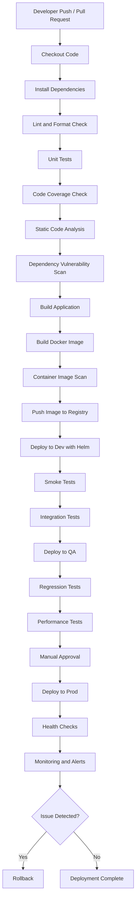

# CI/CD Pipeline Tutorial

This guide explains a typical CI/CD pipeline from pull request to production deployment. It includes the major stages, what each step checks, example commands, and best practices for safe releases.

## High-Level Flow

```text
Developer pushes code
        ↓
CI pipeline starts
        ↓
Build + test + scan
        ↓
Create Docker image
        ↓
Push image to registry
        ↓
Deploy to Dev
        ↓
Run integration tests
        ↓
Deploy to QA
        ↓
Run regression/security tests
        ↓
Manual approval
        ↓
Deploy to Prod
        ↓
Monitor + rollback if needed
```

## Pipeline Flowchart



## 1. Developer Opens a Pull Request

A developer pushes code to a feature branch and opens a pull request.

Example:

```text
feature/login-fix -> main
```

Checks that should run:

- Code formatting check
- Linting
- Unit tests
- Basic security scan
- Build validation

Goal: catch problems before the code is merged.

## 2. Checkout Code

The CI system pulls the exact code being reviewed.

Common CI tools:

- GitHub Actions
- GitLab CI
- Jenkins
- Azure DevOps
- CircleCI

Example operation:

```bash
git checkout feature-branch
```

Goal: make sure the pipeline runs against the correct branch, commit, or pull request.

## 3. Install Dependencies

The pipeline installs application dependencies.

Node.js:

```bash
npm ci
```

Python:

```bash
pip install -r requirements.txt
```

Java:

```bash
mvn clean install
```

Checks:

- Dependency install succeeds.
- Lock files are used when available.
- Builds are repeatable.

Common dependency files:

| Ecosystem | Files |
| --- | --- |
| Node.js | `package-lock.json`, `yarn.lock` |
| Python | `requirements.txt`, `poetry.lock` |
| Java | `pom.xml` |

Goal: avoid "works on my machine" problems.

## 4. Linting and Formatting

The pipeline checks code style and catches common mistakes.

Node.js examples:

```bash
npm run lint
npm run format:check
```

Python examples:

```bash
flake8 .
black --check .
```

Common issues caught:

- Unused variables
- Bad imports
- Syntax problems
- Formatting differences
- Basic coding mistakes

Goal: keep code clean and consistent.

## 5. Unit Tests

Unit tests verify small isolated parts of the application, such as functions, classes, or modules.

Node.js:

```bash
npm test
```

Python:

```bash
pytest tests/unit
```

Required checks:

- All unit tests pass.
- Tests are not flaky.
- Test execution time is reasonable.

Goal: verify the smallest parts of the application work correctly.

## 6. Code Coverage Check

The pipeline checks how much code is covered by tests.

Example:

```bash
pytest --cov=app --cov-report=term
```

Common rule:

```text
Fail the pipeline if coverage is below 80%.
```

Goal: prevent large untested changes from being merged.

## 7. Static Code Analysis

Static analysis scans the code without running the application.

Common tools:

- SonarQube
- CodeQL
- Semgrep
- ESLint security rules

Checks for:

- Bug-prone code
- Unsafe patterns
- Hardcoded secrets
- SQL injection risk
- High complexity
- Duplicate code

Goal: catch quality and security problems early.

## 8. Dependency Vulnerability Scan

The pipeline scans third-party libraries for known vulnerabilities.

Common tools:

- Snyk
- Dependabot
- OWASP Dependency Check
- `npm audit`
- `pip-audit`
- Trivy

Node.js example:

```bash
npm audit --audit-level=high
```

Filesystem scan example:

```bash
trivy fs .
```

Common rule:

- Fail the build on critical vulnerabilities.
- Warn or fail on medium/high vulnerabilities depending on company policy.

Goal: avoid shipping known vulnerable packages.

## 9. Build Application

The application is compiled or packaged.

Node.js:

```bash
npm run build
```

Java:

```bash
mvn package
```

Checks:

- Build completes successfully.
- Build artifact is created.
- Version number or commit SHA is attached.

Goal: create a deployable application artifact.

## 10. Build Docker Image

The pipeline builds a container image.

Example:

```bash
docker build -t my-app:1.0.25 .
```

Recommended tag formats:

```text
my-app:<git-sha>
my-app:<semantic-version>
my-app:<build-number>
```

Example:

```text
my-app:a7f92c1
```

Checks:

- Docker build succeeds.
- Image starts correctly.
- Image size is reasonable.

Goal: package the application consistently for Kubernetes or another container platform.

## 11. Container Image Scan

The built Docker image is scanned for vulnerabilities.

Example:

```bash
trivy image my-app:a7f92c1
```

Checks for:

- Vulnerable OS packages
- Vulnerable language libraries
- Secrets inside the image
- Unsafe or outdated base images

Common rule:

```text
Fail the pipeline if the image has critical vulnerabilities.
```

Goal: avoid deploying unsafe images.

## 12. Push Image to Container Registry

The image is pushed to a registry so deployment systems can pull it.

Common registries:

- Amazon ECR
- Docker Hub
- GitHub Container Registry
- Azure Container Registry

Example:

```bash
docker tag my-app:a7f92c1 123456789.dkr.ecr.us-east-1.amazonaws.com/my-app:a7f92c1
docker push 123456789.dkr.ecr.us-east-1.amazonaws.com/my-app:a7f92c1
```

Goal: make the image available for deployment.

## Deployment Stages

The deployment stages promote the same tested image through Dev, QA, and Production.

Important rule:

```text
Build once. Promote the same image.
```

Do not rebuild separately for Dev, QA, and Prod.

## 13. Deploy to Dev Environment

The app is deployed to Dev, often using Helm.

Example:

```bash
helm upgrade --install my-app-dev ./helm/my-app \
  -f ./helm/my-app/values-dev.yaml \
  --set image.tag=a7f92c1 \
  --namespace dev
```

Dev checks:

- Kubernetes manifests render correctly.
- Pods start successfully.
- Service endpoints are reachable.
- ConfigMaps and Secrets are mounted correctly.

Useful commands:

```bash
kubectl get pods -n dev
kubectl get svc -n dev
kubectl describe pod <pod-name> -n dev
kubectl logs <pod-name> -n dev
```

Goal: verify the app can deploy successfully.

## 14. Smoke Tests in Dev

Smoke tests confirm the app is alive after deployment.

Example checks:

- `/health` returns `200`.
- Login page loads.
- API responds.
- Database connection works.
- Required dependencies are reachable.

Example:

```bash
curl -f https://dev.example.com/health
```

Goal: catch obvious deployment failures quickly.

## 15. Integration Tests

Integration tests run against real dependencies or test versions of dependencies.

Example tests:

- API can read and write to the database.
- App can publish to a queue.
- App can read from S3.
- Service-to-service calls work.
- Authentication works.

Goal: verify the app works as part of the larger system.

## 16. Deploy to QA

The same Docker image that passed Dev is promoted to QA.

Example:

```bash
helm upgrade --install my-app-qa ./helm/my-app \
  -f ./helm/my-app/values-qa.yaml \
  --set image.tag=a7f92c1 \
  --namespace qa
```

Goal: test the same artifact in a more production-like environment.

## 17. Regression Tests in QA

A larger test suite runs in QA.

Examples:

- End-to-end UI tests
- API regression tests
- Payment flow tests
- User signup flow tests
- Critical business workflows

Tools:

- Selenium
- Cypress
- Playwright
- Postman/Newman
- REST Assured

Example:

```bash
newman run regression-tests.postman_collection.json
```

Goal: make sure new changes did not break existing features.

## 18. Performance Tests

The app is tested under load.

Tools:

- k6
- JMeter
- Gatling
- Locust

Example:

```bash
k6 run load-test.js
```

Checks:

- p95 latency
- p99 latency
- Error rate
- Throughput
- CPU and memory usage
- Database load

Example pass criteria:

```text
p95 latency < 500ms
error rate < 1%
CPU < 75%
```

Goal: catch performance problems before production.

## 19. Security Tests

The pipeline runs deeper security checks.

Examples:

- DAST scan against QA
- API security scan
- TLS check
- Authentication and authorization checks
- Secret scanning
- Kubernetes manifest scan

Tools:

- OWASP ZAP
- Checkov
- kube-score
- Polaris
- Kubescape

Example:

```bash
checkov -d ./helm/my-app
```

Goal: catch security problems before production.

## 20. Manual Approval Before Production

A human approves the production deployment.

Common approvers:

- Tech lead
- Release manager
- On-call engineer
- Product owner, depending on company process

Review before approving:

- Test results
- Change summary
- Risk level
- Rollback plan
- Monitoring dashboard
- Deployment window

Goal: prevent risky changes from going directly to production.

## Production Deployment

Production deployment should use the same image that passed earlier stages.

## 21. Deploy to Production

The same tested image is deployed to Prod.

Example:

```bash
helm upgrade --install my-app-prod ./helm/my-app \
  -f ./helm/my-app/values-prod.yaml \
  --set image.tag=a7f92c1 \
  --namespace prod
```

Safer deployment strategies:

| Strategy | Description |
| --- | --- |
| Rolling deployment | Replace pods gradually |
| Blue/Green deployment | Deploy new version beside old version, then switch traffic when healthy |
| Canary deployment | Send a small traffic percentage first, then increase if healthy |

Example canary flow:

```text
5% traffic -> 25% traffic -> 50% traffic -> 100% traffic
```

Goal: deploy without causing downtime.

## 22. Production Health Checks

After deployment, the pipeline checks production health.

Checks:

- Pods are running.
- ALB target health is healthy.
- `/health` endpoint returns `200`.
- No spike in `5xx` errors.
- Latency is normal.
- Logs do not show new errors.

Useful commands:

```bash
kubectl rollout status deployment/my-app -n prod
kubectl get pods -n prod
kubectl logs deployment/my-app -n prod
```

Goal: confirm the production release is healthy.

## 23. Monitoring and Alerting

After production deployment, monitoring validates the release.

Common signals:

- Error rate
- Request latency
- Traffic volume
- CPU and memory usage
- Pod restarts
- Application logs
- Business metrics

Goal: detect production issues quickly.

## 24. Automatic Rollback

If health checks fail, the pipeline can roll back automatically.

Helm rollback:

```bash
helm rollback my-app-prod -n prod
```

Kubernetes rollout rollback:

```bash
kubectl rollout undo deployment/my-app -n prod
```

Rollback triggers:

- Deployment fails.
- Pods crashloop.
- Health check fails.
- `5xx` error rate increases.
- Latency crosses a threshold.

Goal: reduce customer impact quickly.

## Practical Full Flow

1. Developer creates PR.
2. CI runs lint, unit tests, coverage, and security scan.
3. PR gets approved and merged.
4. Pipeline builds the application.
5. Pipeline builds the Docker image.
6. Pipeline scans the Docker image.
7. Image is pushed to the registry.
8. Helm deploys the image to Dev.
9. Smoke and integration tests run.
10. Same image is promoted to QA.
11. Regression, security, and performance tests run.
12. Manual approval happens.
13. Same image is promoted to Prod.
14. Production health checks run.
15. Monitoring validates latency and errors.
16. Rollback happens automatically if health is bad.

## Key Best Practices

- Build the artifact once, then promote the same image.
- Do not rebuild separately for Dev, QA, and Prod.
- Keep environment differences in Helm values files.
- Fail early on tests and security issues.
- Use manual approval before production.
- Always have a rollback plan.
- Monitor production immediately after deployment.
- Use canary or blue/green deployments for high-risk services.

## CI vs CD

| Step | Name | Area |
| ---: | --- | --- |
| 1 | Developer opens Pull Request | CI |
| 2 | Checkout Code | CI |
| 3 | Install Dependencies | CI |
| 4 | Linting and Formatting | CI |
| 5 | Unit Tests | CI |
| 6 | Code Coverage Check | CI |
| 7 | Static Code Analysis | CI |
| 8 | Dependency Vulnerability Scan | CI |
| 9 | Build Application | CI |
| 10 | Build Docker Image | CI |
| 11 | Container Image Scan | CI |
| 12 | Push Image to Container Registry | CI/CD boundary |
| 13 | Deploy to Dev Environment | CD |
| 14 | Smoke Tests in Dev | CD |
| 15 | Integration Tests | CD |
| 16 | Deploy to QA | CD |
| 17 | Regression Tests in QA | CD |
| 18 | Performance Tests | CD |
| 19 | Security Tests | CD |
| 20 | Manual Approval Before Production | CD |
| 21 | Deploy to Production | CD |
| 22 | Production Health Checks | CD |
| 23 | Monitoring and Alerting | CD / Operations |
| 24 | Automatic Rollback | CD |

Step 12 is often the handoff point: CI produces the artifact, and CD deploys that artifact.

